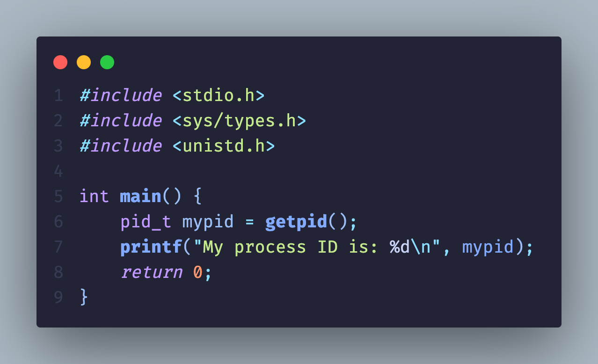
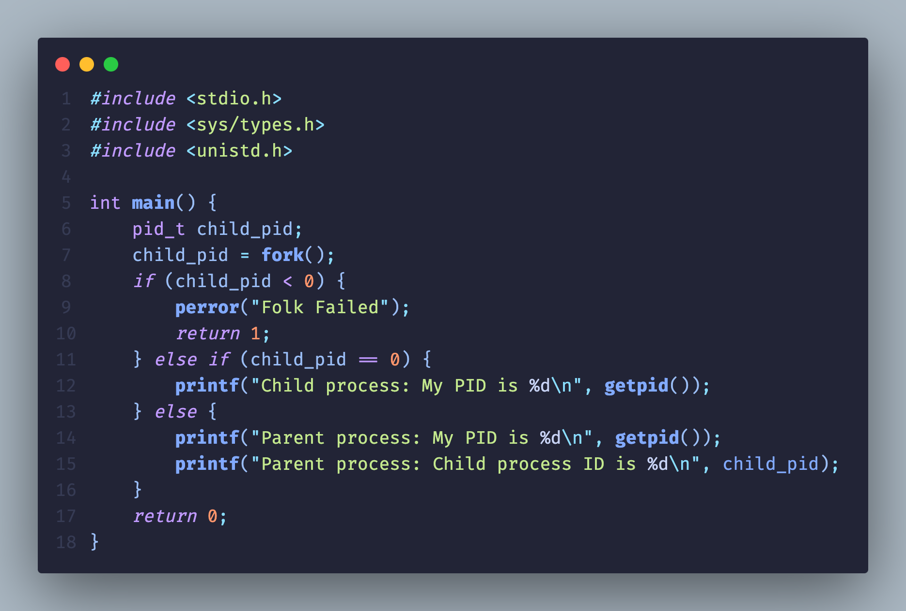
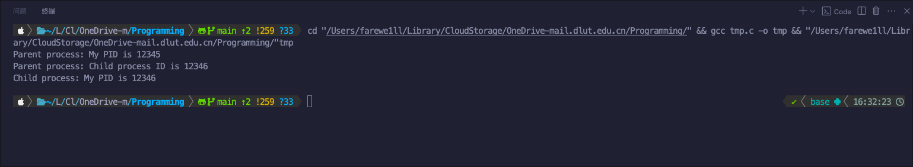
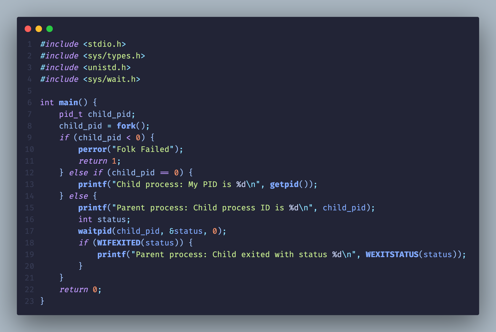
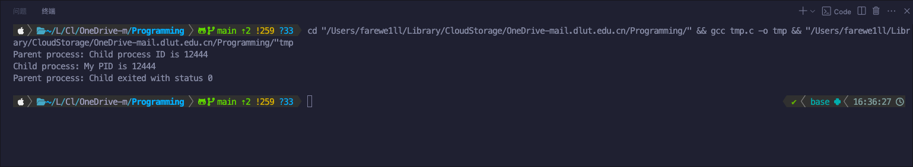
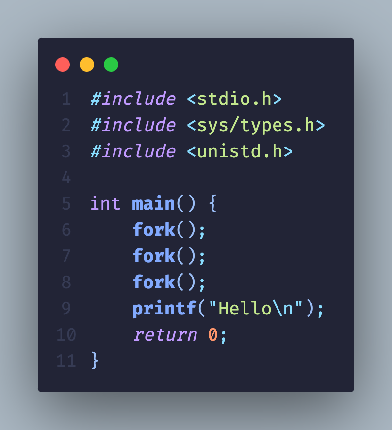

# Linux C Code-CLI compile

该实例说明了函数 getpid() 可以返回当前进程 pid，其类型为 pid_t。

该实例体现了函数 fork() 可以在当前程序运行处生成一个和当前程序进度相同的子进程，若创建失败则父进程中 fork() 函数返回值小于 0，若成功则父进程中 fork() 函数返回子进程 pid，子进程中 fork() 函数返回值为 0

该实例体现了 waitpid 函数，当传入的 child_pid > 0 时会等待 pid 为 child_pid 的子进程退出并通过第二参数指针得到子进程退出状态，可以通过 WIFEXITED 函数得到退出返回值。

如上。三次 fork() 均成功，产生 $2^3 = 8$ 个进程，分别输出 Hello。

如上。