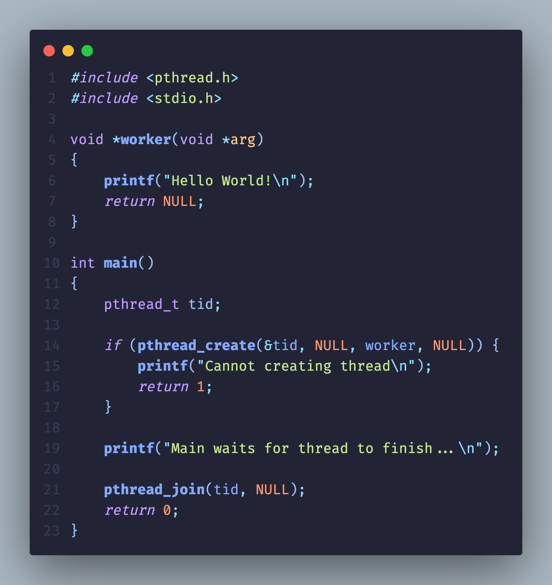
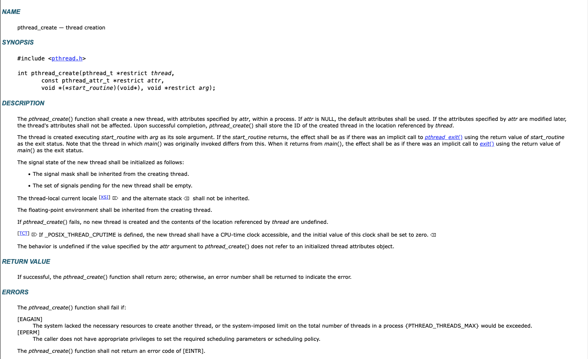
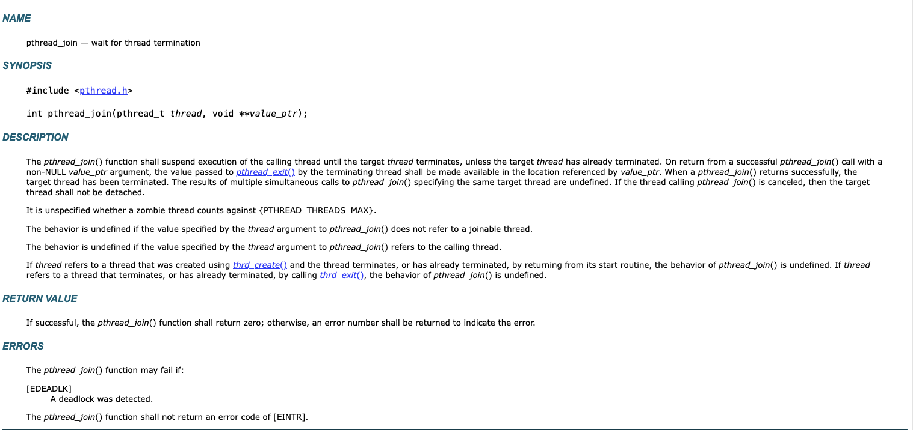
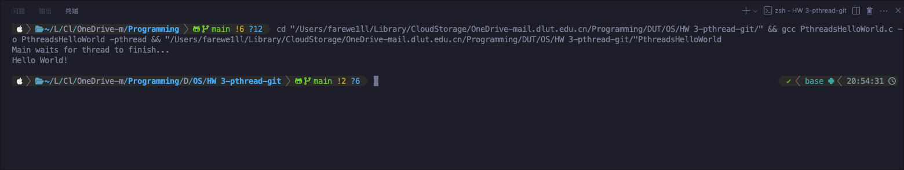
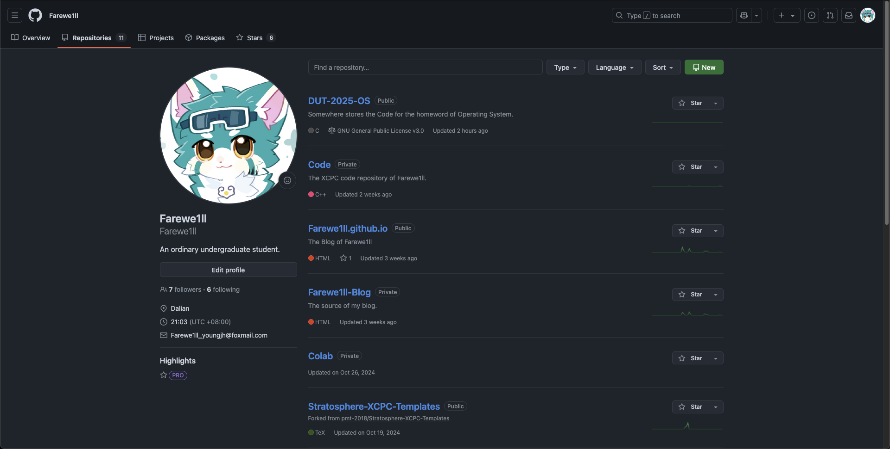
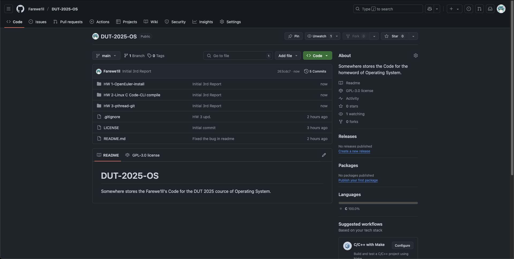

# pthread-git

## pthread Section

## 1. pthread 线程库



程序如上，在 [opengroup](https://pubs.opengroup.org) 官网查到 pthread_create 函数和 pthread_join 函数如下：




实际使用编译指令及程序运行结果如下：



可以看到 pthread 库以 work 函数成功创建了新的线程，完成输出后等待线程完成和主程序合并。

## Github Section

由于可能之前有过建立 Gibhub Repository 的经验，所以一些前期的工作已经完成，并且本次汇报可能会少一些实时动态输出截屏 QwQ

由于未知因素，4 月 13 日大陆地区 ip 无法正常访问 Github。~~这时候需要一点小小的魔法。~~

### 1. 建立远程仓库

在 [我自己的 Github 个人主页](https://github.com/Farewe1ll?tab=repositories) 上，点击 New 创建新仓库。



在页面中完成个人配置。


由于此处我已经建立好仓库，故提示无法如此命名。可以勾选选择 README.md，我自己选择了较为严格的 GPLv3 证书。

由于仓库中可能存在 C 代码，故此处我选择将 .gitignore 设置为 C，但是后续马上也会修改。

### 2. 建立本地仓库

在合适的位置下创建文件夹，并且初始化 git。

```shell
git init
```

设置远程仓库和本地 main 分支。

```shell
git remote add origin git@github.com:Farewe1ll/DUT-2025-OS.git
git branch -M main
```

### 3. 进行内容修改以及提交

拉取已经存在的 README.md 和 .gitignore。

```shell
git pull origin main
```

之后对 .gitignore 进行了一些修改。

完成后，将更改添加入暂存区并完成提交。

```shell
git add .
git commit -m "First try"
git push -u origin main
```

以上。经过内容的完善，最终 Github 呈现效果如图。

