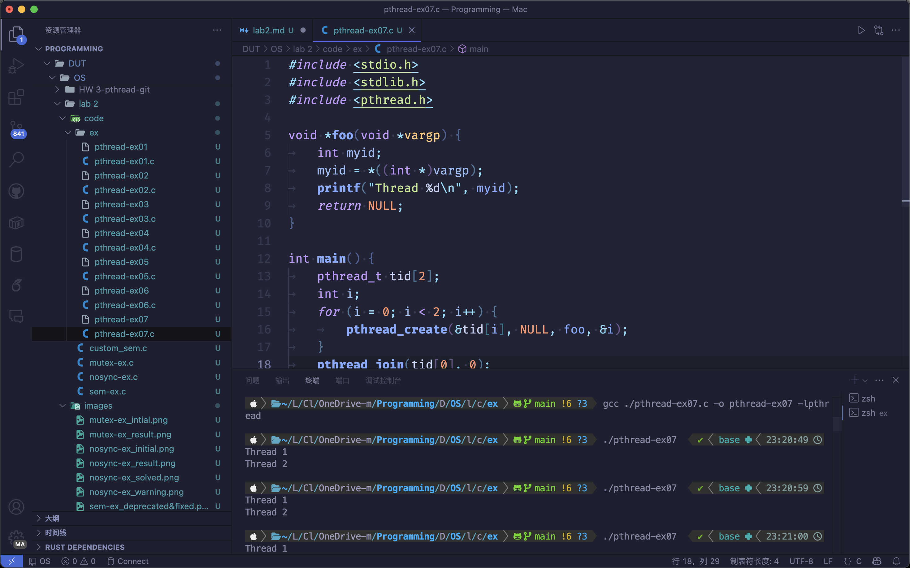

# lab 2: pthread

## task1: 熟悉 API

### nosync-ex.c

编写 `nosyc-ex.c` 代码

发现该代码会在函数末无返回值时报 warning，在函数结尾添加 `return NULL;` 解决该报错。

多次运行发现程序运行结果不同。原因：在两个线程运行过程中没有设计互斥，导致变量被复用无法正确访问。

### mutex-ex.c

编写 `mutex-ex.c` 代码

该代码通过设计 `mutex` 互斥锁，保证缓冲区中变量的正常使用。故而运行可以得到正确结果。

### sem-ex.c

编写 `mutex-ex.c` 代码

发现在 macOS 系统下原始代码会出现警告。经查找，发现是在 macOS 中 `sem_init` 函数被弃用，将 `sem` 改为指针类型并且将 `sem_init` 改为 `sem_open` 函数即可正常编译运行。

该代码通过设计 `sem` 信号量，保证缓冲区中变量的正常使用。故而运行可以得到正确结果。

## task2: 实现生产者消费者问题

在 `custom_sem.c` 中，我分别设计了两个生产者和两个消费者，均进行 $5$ 轮生产/消费活动。维护三个信号量 `full`, `empty`, `mutex`，分别代表目前有产物的位置个数、空的位置个数和互斥锁，初始 `full = size, empty = 0, mutex = 1`，然后分别维护消费者和生产者的行为。

## task3: 代码阅读理解

### pthread-ex01.c vs pthread-ex02.c

`pthread-ex01.c` 输出 $42$，`pthread-ex02.c` 无输出并且返回错误。

原因：`pthread-ex01.c` 程序线程正常返回并且将返回值传给 `i`，`pthread-ex02.c` 在线程中直接退出程序导致程序被强制结束。

### pthread-ex03.c

输出为 $42$ 或 $0$，不确定。

如果 `thread1` 先于 `thread2` 执行完第 10 行，程序输出为 $42$。如果 `thread2` 先执行完第 11 行，`thread1` 读取到的值为 $0$，程序输出为 $0$。

由于线程执行顺序不确定，程序的输出结果也不确定。

### pthread-ex04.c

测试时第一次输出 $0$，第二次程序无响应手动退出。

该程序存在逻辑问题：
- `pthread_detach` 表示线程结束后自动释放资源，不需要被其他线程显式回收
- `pthread_join` 则是显式等待线程结束并回收其资源

因为线程已经被分离，所以 `pthread_join` 很可能会失败，无法成功获取线程的返回值 $42$。该程序很可能产生未定义行为。

### pthread-ex05.c

输出结果几乎全是 $31$，但是观察到一次结果为 $42$。

输出结果取决于线程的实际执行顺序：如果线程 2 先执行，打印结果会是 $31$；如果线程 1 先执行，打印结果会是 $42$。

由于线程 2 先创建，且线程 2 内容简单，故而几乎全是线程 2 先执行。

### pthread-ex06.c

编译过程

输出结果几乎全是 `Thread 0\nThread 1\n`，但观察到一次 `Thread 1\nThread 0\n`。

由于两个线程的运行顺序不一定，故输出结果也不一定。由于线程 0 先创建，故而大部分均为线程 0 先输出。

### pthread-ex07.c

编译过程

输出结果几乎全是 `Thread 1\nThread 2\n`，但观察到一次 `Thread 2\nThread 2\n`。

两个线程共享同一个变量 `i` 的地址。可能在第一个线程开始执行 `foo` 函数之前，`i` 的值已经变成了 $1$ 或 $2$。程序的输出不确定。

## task4: 理发师问题

见 `./code/barber.c`

通过维护 `customers`、`barbers`、`mutex` 三个信号量，实现了理发师问题的解决方案。其中 `customers` 表示等待理发的顾客数量，初始值为 $0$，`barbers` 表示空闲理发师数量，初始值为 $0$，`mutex` 用于互斥访问等候区，初始值为 $1$。