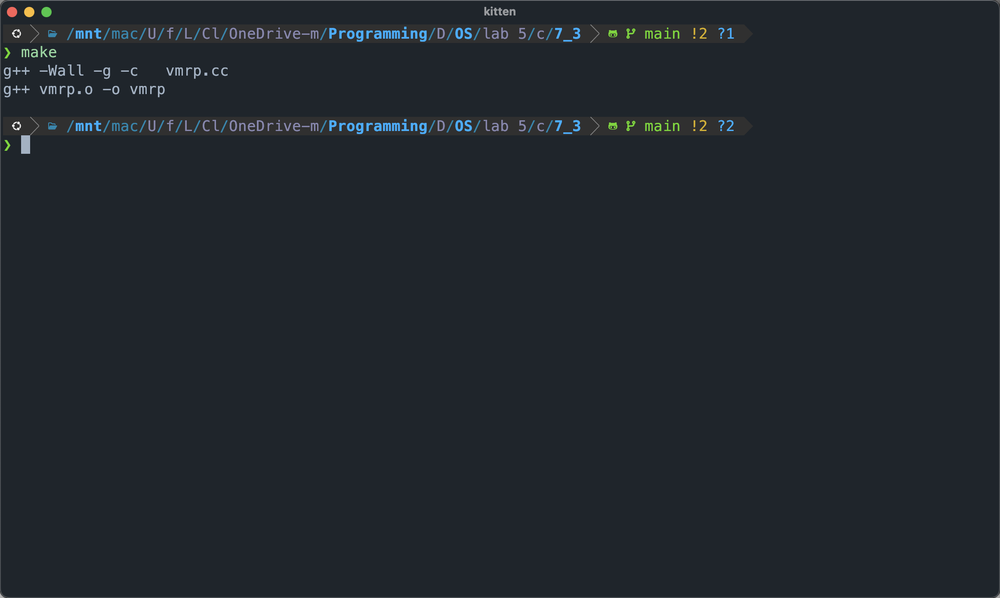
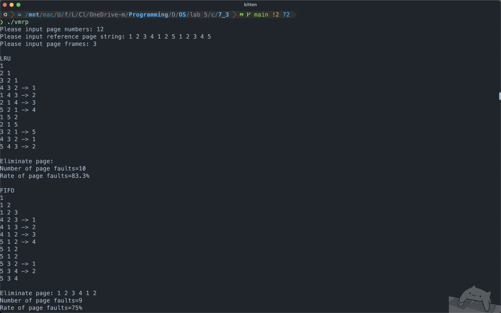
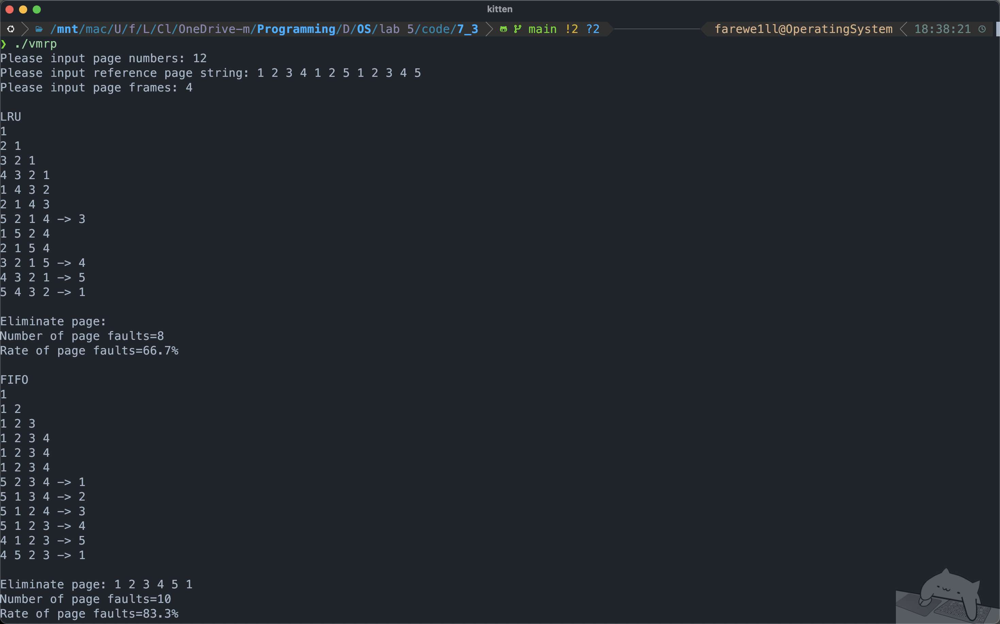
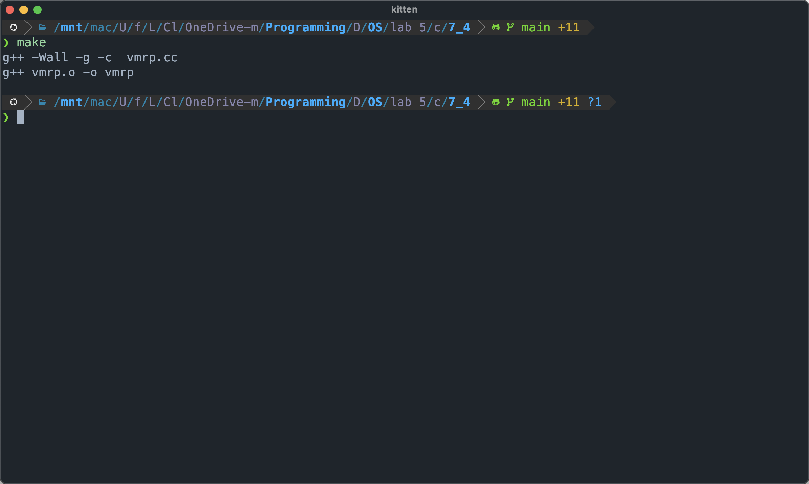

# lab 5: page-replacement-sim

## 7.3 示例实验

提取并编写 `./code/7_3/vmrp.h`、`./code/7_3/vmrp.cc` 代码

发现原实验代码有误：
- `vmrp.h` 中使用了旧式 C++ 头文件 `<iomanip.h>`，需改为 `<iomanip>`。
- `vmrp.h` 代码中使用了 C 头文件 `<malloc.h>`，根据后续 `vmrp.cc` 分析，该头文件为 C++ 头文件，应使用 `<cstdlib>`。
- `vmrp.cc` 代码中并未使用 `using namespace std;`，但是使用了 `cin` 与 `cout`。应在开头加上 `using std::cin, std::cout;` 或 `using namespace std;`，如果选择后者，需要注意将 `next` 变量名改为 `nxt`，否则在高版本语言标准下可能出错。

`make` 结果如下


发现实验手册中代码有误，应当调用 `./vmrp` 而非 `./vmpr`

第一次，内存页帧数为 $3$，得到结果


第二次，内存页帧数为 $4$，得到结果


从以上输出中可以看出 `FIFO` 置换算法的 Belady 异常现象，即当在相同的引用串下内存页帧数从 $3$ 帧增加到 $4$ 帧，页出错率反而从 $75\%$ 增加到了 $83.3\%$。而在相同的情况下 `LRU` 置换算法无此异常现象。

注意到此处实验手册中误将 `LRU` 写为 LUR。

## 7.4 独立实验

为方便调试，我将原本的 C Style 的内存申请修改为了 `std::vector<T>` 以便调试。

提取并编写 `./code/7_4/vmrp.h`、`./code/7_4/vmrp.cc` 代码

```cpp
// vmrp.h
#include <iostream>
#include <iomanip>
#include <cstdlib>
#include <vector>

class Replace {
public:
	Replace();
	~Replace();
	void InitSpace(char *MethodName);	// 初始化页号记录
	void Report(void);					// 报告算法执行情况
	void Fifo(void);					// 先进先出算法
	void Lru(void);						// 最近最旧未用算法
	void Clock(void);					// 时钟(二次机会)置换算法
	void Eclock(void);					// 增强二次机会置换算法
	void Lfu(void);						// 最不经常使用置换算法
	void Mfu(void);						// 最经常使用置换算法
	void GenerateRandomSequence(int totalPages, int sequenceLength);

private:
	std::vector<int> ReferencePage;	// 存放要访问到的页号
	std::vector<int> EliminatePage;	// 存放淘汰页号
	std::vector<int> PageFrames;	// 存放当前正在实存中的页号
	int PageNumber;					// 访问页数
	int FrameNumber;				// 实存帧数
	int FaultNumber;				// 失败页数
};
```

```cpp
// vmrp.cc
#include <vector>
#include <chrono>
#include <random>
#include "vmrp.h"

using namespace std;

Replace::Replace() {
	int i;
	// 设定总访问页数，并分配引用页号和淘汰页号记录数组空间
	cout << "Please input page numbers: ";
	cin >> PageNumber;
	ReferencePage.resize(PageNumber);
	EliminatePage.assign(PageNumber, -1);

	// 输入引用页号序列（页面走向）
	cout << "Please input reference page string: ";
	for (i = 0; i < PageNumber; ++i) {
		cin >> ReferencePage[i];
	}

	// 输入内存实页数（帧数）
	cout << "Please input page frames: ";
	cin >> FrameNumber;

	PageFrames.assign(FrameNumber, -1);
}

void Replace::GenerateRandomSequence(int totalPages, int sequenceLength) {
	mt19937_64 rnd(chrono::steady_clock::now().time_since_epoch().count());
	PageNumber = sequenceLength;
	ReferencePage.resize(PageNumber);
	for (int i = 0; i < PageNumber; ++i) {
		ReferencePage[i] = rnd() % totalPages + 1;
	}
}

Replace::~Replace() {}

void Replace::InitSpace(char *MethodName) {
	cout << endl << MethodName << endl;
	FaultNumber = 0;
	// 初始化淘汰页数组和页帧数组
	fill(EliminatePage.begin(), EliminatePage.end(), -1);
	fill(PageFrames.begin(), PageFrames.end(), -1);
}

void Replace::Report(void) {
	// 报告淘汰页顺序
	cout << endl << "Eliminate page: ";
	for (int i = 0; EliminatePage[i] != -1; ++i) {
		cout << EliminatePage[i] << " ";
	}

	// 报告缺页数和缺页率
	cout << endl << "Number of page faults=" << FaultNumber << endl;
	cout << std::setw(6) << std::setprecision(3);
	cout << "Rate of page faults="
			<< 100 * (float)FaultNumber / (float)PageNumber << "%" << endl;
}

// 最近最旧未用算法（LRU）
void Replace::Lru(void) {
	int i, j, k, l = 0, nxt;
	InitSpace(const_cast<char*>("LRU"));

	for (k = 0; k < PageNumber; ++k) {
		nxt = ReferencePage[k];
		// 检查页是否已在内存
		for (i = 0; i < FrameNumber; ++i) {
			if (nxt == PageFrames[i]) {
				// 调整栈顶
				for (j = i; j > 0; j--) {
					PageFrames[j] = PageFrames[j-1];
				}
				PageFrames[0] = nxt;
				break;
			}
		}

		if (PageFrames[0] == nxt) {
			// 页已在内存
			for (j = 0; j < FrameNumber; ++j) {
				if (PageFrames[j] >= 0) cout << PageFrames[j] << " ";
			}
			cout << endl;
			continue;
		} else {
			// 缺页处理
			FaultNumber++;
			EliminatePage[l] = PageFrames[FrameNumber-1];

			// 压栈操作
			for (j = FrameNumber-1; j > 0; j--) {
				PageFrames[j] = PageFrames[j-1];
			}
			PageFrames[0] = nxt;
			l++;
		}

		// 输出当前状态
		for (j = 0; j < FrameNumber; ++j) {
			if (PageFrames[j] >= 0) cout << PageFrames[j] << " ";
		}
		if (EliminatePage[l-1] >= 0) {
			cout << "-> " << EliminatePage[l-1];
		}
		cout << endl;
	}
	Report();
}

// 先进先出算法（FIFO）
void Replace::Fifo(void) {
	int i, k, l = 0, nxt, ptr = 0;
	InitSpace(const_cast<char*>("FIFO"));

	for (k = 0; k < PageNumber; ++k) {
		nxt = ReferencePage[k];
		// 检查页是否已在内存
		for (i = 0; i < FrameNumber; ++i) {
			if (nxt == PageFrames[i]) break;
		}
		if (i < FrameNumber) {
			// 页已在内存
			for (i = 0; i < FrameNumber; ++i) {
				cout << PageFrames[i] << " ";
			}
			cout << endl;
			continue;
		}

		// 缺页处理
		FaultNumber++;
		EliminatePage[l] = PageFrames[ptr];
		PageFrames[ptr] = nxt;
		ptr = (ptr + 1) % FrameNumber;

		// 输出当前状态
		for (i = 0; i < FrameNumber; ++i) {
			if (PageFrames[i] >= 0) cout << PageFrames[i] << " ";
		}
		if (EliminatePage[l] >= 0) {
			cout << "-> " << EliminatePage[l++];
		} else {
			cout << endl;
		}
	}
	Report();
}

// 未实现的其他算法框架
void Replace::Clock(void) {
	int i, j, k, nxt, cnt = 0;
	InitSpace(const_cast<char*>("CLOCK"));
	vector<int> refBit(FrameNumber, 0);
	int ptr = 0;

	for (k = 0; k < PageNumber; ++k) {
		nxt = ReferencePage[k];

		for (i = 0; i < FrameNumber; ++i) {
			if (nxt == PageFrames[i]) {
				refBit[i] = 1;
				break;
			}
		}

		if (i < FrameNumber) {
			for (j = 0; j < FrameNumber; ++j)
				if (PageFrames[j] >= 0) cout << PageFrames[j] << " ";
			cout << endl;
			continue;
		}

		++FaultNumber;

		for (; ;) {
			if (refBit[ptr] == 0) break;
			refBit[ptr] = 0;
			ptr = (ptr + 1) % FrameNumber;
		}

		EliminatePage[cnt] = PageFrames[ptr];
		PageFrames[ptr] = nxt;
		refBit[ptr] = 1;
		ptr = (ptr + 1) % FrameNumber;

		for (j = 0; j < FrameNumber; ++j) {
			if (PageFrames[j] >= 0) {
				cout << PageFrames[j] << " ";
			}
		}
		if (EliminatePage[cnt] >= 0) {
			cout << "-> " << EliminatePage[cnt++] << endl;
		} else {
			cout << endl;
		}
	}

	Report();
}
void Replace::Eclock(void) {
	InitSpace(const_cast<char*>("ECLOCK"));

	int i, j, nxt, cnt = 0;
	vector<int> refBit(FrameNumber, 0), modBit(FrameNumber, 0);
	int ptr = 0;

	for (int k = 0; k < PageNumber; ++k) {
		nxt = ReferencePage[k];

		for(i = 0; i < FrameNumber; ++i) {
			if(nxt == PageFrames[i]) {
				refBit[i] = 1;
				// if (modify) modBit[i] = 1;
				break;
			}
		}

		if (i < FrameNumber) {
			for (j = 0; j < FrameNumber; ++j) {
				if (PageFrames[j] >= 0) {
					cout << PageFrames[j] << " ";
				}
			}
			cout << endl;
			continue;
		}

		++FaultNumber;

		bool found = 0;
		for (i = 0; i < FrameNumber; ++i) {
			if (PageFrames[i] == -1) {
				ptr = i;
				found = 1;
				break;
			}
		}
		for (int p = (ptr + 1) % FrameNumber; p != ptr && !found ; ++p, p %= FrameNumber) {
			if (refBit[p] == 0 && modBit[p] == 0) {
				found = 1;
				ptr = p;
				break;
			}
		}
		for (int p = (ptr + 1) % FrameNumber; p != ptr && !found ; ++p, p %= FrameNumber) {
			if (refBit[p] == 0 && modBit[p] == 1) {
				found = 1;
				ptr = p;
				break;
			}
			refBit[p] = 0;
		}
		for (int p = (ptr + 1) % FrameNumber; p != ptr && !found ; ++p, p %= FrameNumber) {
			if (refBit[p] == 0 && modBit[p] == 0) {
				found = 1;
				ptr = p;
				break;
			}
		}
		for (int p = (ptr + 1) % FrameNumber; p != ptr && !found ; ++p, p %= FrameNumber) {
			if (refBit[p] == 0 && modBit[p] == 1) {
				found = 1;
				ptr = p;
				break;
			}
		}

		EliminatePage[cnt] = PageFrames[ptr];

		PageFrames[ptr] = nxt;
		refBit[ptr] = 1;
		modBit[ptr] = 0;

		ptr = (ptr + 1) % FrameNumber;

		for (j = 0; j < FrameNumber; ++j) {
			if (PageFrames[j] >= 0) {
				cout << PageFrames[j] << " ";
			}
		}
		if (EliminatePage[cnt] >= 0) {
			cout << "-> " << EliminatePage[cnt++] << endl;
		} else {
			cout << endl;
		}
	}

	Report();
}
void Replace::Lfu(void) {
	int i, j, nxt, cnt = 0;
	InitSpace(const_cast<char*>("LFU"));
	vector<int> freqCount(FrameNumber, 0);

	for (int k = 0; k < PageNumber; ++k) {
		nxt = ReferencePage[k];

		for (i = 0; i < FrameNumber; ++i) {
			if (nxt == PageFrames[i]) {
				++freqCount[i];
				break;
			}
		}

		if (i < FrameNumber) {
			for (j = 0; j < FrameNumber; ++j)
				if (PageFrames[j] >= 0) cout << PageFrames[j] << " ";
			cout << endl;
			continue;
		}

		++FaultNumber;

		int minIndex = 0;
		for (i = 1; i < FrameNumber; ++i) {
			if (freqCount[i] < freqCount[minIndex]) {
				minIndex = i;
			}
		}

		EliminatePage[cnt] = PageFrames[minIndex];
		PageFrames[minIndex] = nxt;
		freqCount[minIndex] = 1;

		for (j = 0; j < FrameNumber; ++j) {
			if (PageFrames[j] >= 0) {
				cout << PageFrames[j] << " ";
			}
		}
		if (EliminatePage[cnt] >= 0) {
			cout << "-> " << EliminatePage[cnt++] << endl;
		} else {
			cout << endl;
		}
	}

	Report();
}
void Replace::Mfu(void) {
	int i, j, nxt, cnt = 0;
	InitSpace(const_cast<char*>("MFU"));
	vector<int> freqCount(FrameNumber, 0);

	for (int k = 0; k < PageNumber; ++k) {
		nxt = ReferencePage[k];

		for (i = 0; i < FrameNumber; ++i) {
			if (nxt == PageFrames[i]) {
				++freqCount[i];
				break;
			}
		}

		if (i < FrameNumber) {
			for (j = 0; j < FrameNumber; ++j) {
				if (PageFrames[j] >= 0) {
					cout << PageFrames[j] << " ";
				}
			}
			cout << endl;
			continue;
		}

		++FaultNumber;

		int maxIndex = -1;
		for (i = 0; i < FrameNumber; ++i) {
			if (PageFrames[i] == -1) {
				maxIndex = i;
				break;
			}
		}

		if (maxIndex == -1) {
			maxIndex = 0;
			for (i = 1; i < FrameNumber; ++i) {
				if (freqCount[i] > freqCount[maxIndex]) {
					maxIndex = i;
				}
			}
		}

		EliminatePage[cnt] = PageFrames[maxIndex];
		PageFrames[maxIndex] = nxt;
		freqCount[maxIndex] = 1;

		for (j = 0; j < FrameNumber; ++j) {
			if (PageFrames[j] >= 0) cout << PageFrames[j] << " ";
		}
		if (EliminatePage[cnt] >= 0) {
			cout << "-> " << EliminatePage[cnt++] << endl;
		} else {
			cout << endl;
		}
	}

	Report();
}

int main(int argc, char *argv[]) {
	Replace *vmpr = new Replace();
	vmpr->Lru();
	vmpr->Fifo();
	vmpr->Clock();
	vmpr->Eclock();
	vmpr->Lfu();
	vmpr->Mfu();
	delete vmpr;
	return 0;
}
```

编写代码的过程中，遇到了如下问题：
1. `Mfu` 函数的实现过程中，`freqCount` 初值为 $0$，导致直接找 `maxIndex` 会导致总是找到第一个刚插入的帧，故而需要加入空闲帧判断。
2. `EClock` 函数的具体实现应当涉及是否有过修改，而该信息在初始输入中并未给出，故 `EClock` 函数在该情况下与 `Clock` 函数行为相仿。
3. `vmrp.cc` 文件中使用 `<chrono>` 和 `<ramdom>` 中的 `steady_clock` 和 `mt19937_64` 实现了 `GenerateRandomSequence`，但是在实际代码测试中考虑到便捷等因素并未加入。

`make` 结果如下


由于具体的输出过长，将其重定向到 `./code/7_4/res3.txt` 和 `./code/7_4/res4.txt` 中，输出如下

```text
// res3.txt
Please input page numbers: 12
Please input reference page string: 1 2 3 4 1 2 5 1 2 3 4 5
Please input page frames: 3

LRU
1
2 1
3 2 1
4 3 2 -> 1
1 4 3 -> 2
2 1 4 -> 3
5 2 1 -> 4
1 5 2
2 1 5
3 2 1 -> 5
4 3 2 -> 1
5 4 3 -> 2

Eliminate page:
Number of page faults=10
Rate of page faults=83.3%

FIFO
1
1 2
1 2 3
4 2 3 -> 14 1 3 -> 24 1 2 -> 35 1 2 -> 45 1 2
5 1 2
5 3 2 -> 15 3 4 -> 25 3 4

Eliminate page: 1 2 3 4 1 2
Number of page faults=9
Rate of page faults=75%

CLOCK
1
1 2
1 2 3
4 2 3 -> 1
4 1 3 -> 2
4 1 2 -> 3
5 1 2 -> 4
5 1 2
5 1 2
5 3 2 -> 1
5 3 4 -> 2
5 3 4

Eliminate page: 1 2 3 4 1 2
Number of page faults=9
Rate of page faults=75%

ECLOCK
1
1 2
1 2 3
1 4 3 -> 2
1 4 3
2 4 3 -> 1
2 4 5 -> 3
2 1 5 -> 4
2 1 5
3 1 5 -> 2
3 1 4 -> 5
3 5 4 -> 1

Eliminate page: 2 1 3 4 2 5 1
Number of page faults=10
Rate of page faults=83.3%

LFU
1
1 2
1 2 3
4 2 3 -> 1
1 2 3 -> 4
1 2 3
5 2 3 -> 1
1 2 3 -> 5
1 2 3
1 2 3
4 2 3 -> 1
5 2 3 -> 4

Eliminate page: 1 4 1 5 1 4
Number of page faults=9
Rate of page faults=75%

MFU
1
1 2
1 2 3
4 2 3 -> 1
1 2 3 -> 4
1 2 3
1 5 3 -> 2
1 5 3
2 5 3 -> 1
2 5 3
2 5 4 -> 3
2 5 4

Eliminate page: 1 4 2 1 3
Number of page faults=8
Rate of page faults=66.7%
```

```text
// res4.txt
Please input page numbers: 12
Please input reference page string: 1 2 3 4 1 2 5 1 2 3 4 5
Please input page frames: 4

LRU
1
2 1
3 2 1
4 3 2 1
1 4 3 2
2 1 4 3
5 2 1 4 -> 3
1 5 2 4
2 1 5 4
3 2 1 5 -> 4
4 3 2 1 -> 5
5 4 3 2 -> 1

Eliminate page:
Number of page faults=8
Rate of page faults=66.7%

FIFO
1
1 2
1 2 3
1 2 3 4
1 2 3 4
1 2 3 4
5 2 3 4 -> 15 1 3 4 -> 25 1 2 4 -> 35 1 2 3 -> 44 1 2 3 -> 54 5 2 3 -> 1
Eliminate page: 1 2 3 4 5 1
Number of page faults=10
Rate of page faults=83.3%

CLOCK
1
1 2
1 2 3
1 2 3 4
1 2 3 4
1 2 3 4
5 2 3 4 -> 1
5 1 3 4 -> 2
5 1 2 4 -> 3
5 1 2 3 -> 4
4 1 2 3 -> 5
4 5 2 3 -> 1

Eliminate page: 1 2 3 4 5 1
Number of page faults=10
Rate of page faults=83.3%

ECLOCK
1
1 2
1 2 3
1 2 3 4
1 2 3 4
1 2 3 4
1 5 3 4 -> 2
1 5 3 4
1 5 3 2 -> 4
1 5 3 2
1 4 3 2 -> 5
1 4 3 5 -> 2

Eliminate page: 2 4 5 2
Number of page faults=8
Rate of page faults=66.7%

LFU
1
1 2
1 2 3
1 2 3 4
1 2 3 4
1 2 3 4
1 2 5 4 -> 3
1 2 5 4
1 2 5 4
1 2 3 4 -> 5
1 2 3 4
1 2 5 4 -> 3

Eliminate page: 3 5 3
Number of page faults=7
Rate of page faults=58.3%

MFU
1
1 2
1 2 3
1 2 3 4
1 2 3 4
1 2 3 4
5 2 3 4 -> 1
5 1 3 4 -> 2
2 1 3 4 -> 5
2 1 3 4
2 1 3 4
2 1 5 4 -> 3

Eliminate page: 1 2 5 3
Number of page faults=8
Rate of page faults=66.7%
```

## 7.5 实验总结

1. `FIFO` 算法在帧数增加时可能出现缺页率上升 (Belady异常) ，而 `LRU` 和 `Eclock` 无此现象。`Eclock` 在混合读写场景中表现更优，尤其在区分修改位 `modBit` 的情况下能减少脏页换出开销。

2. 增强二次机会 `Eclock` 算法模拟方法
	- 数据结构:
		- 使用 `refBit[]` 访问位 和 `modBit[]` 修改位 数组记录页面状态。
		- 指针 `pointer` 模拟时钟扫描过程。
	- 替换策略:
		- 命中处理: 更新对应页面的 `refBit[i] = 1`；若为写操作，则设置 `modBit[i] = 1`。
		- 缺页处理: 采取四次扫描，具体见代码

4.
- `FIFO`
	- 适用于内存帧数较多、引用串无局部性
	- 实现简单，但存在 Belady 异常风险。
- `LRU`
	- 适用于局部性较强的引用模式，如循环访问
	- 利用历史访问信息，减少缺页次数。
- `Eclock`
	- 适用于需区分读写操作的场景，如频繁写入的数据库缓存
	- 结合访问位与修改位，优化脏页替换。

局部性引用串: `LRU` 和 `Eclock` 优于 `FIFO`。
高写入场景: `Eclock` 因优先替换未修改页面，减少了 `I/O` 开销。
