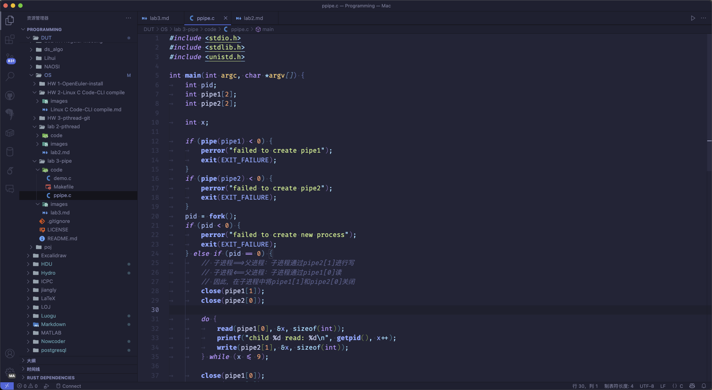
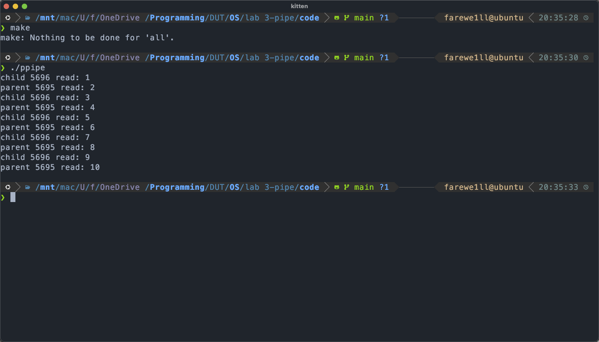
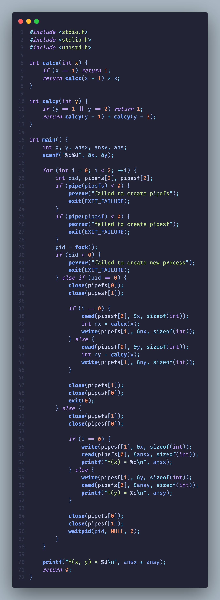
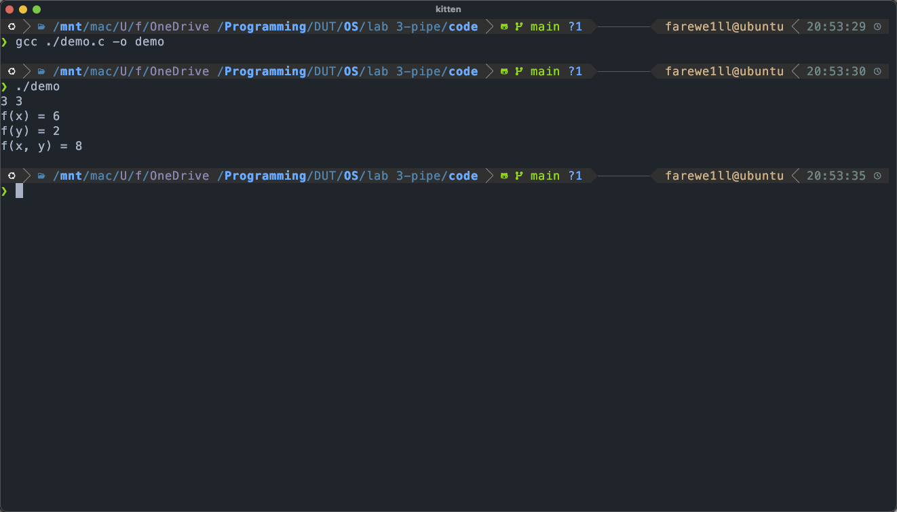
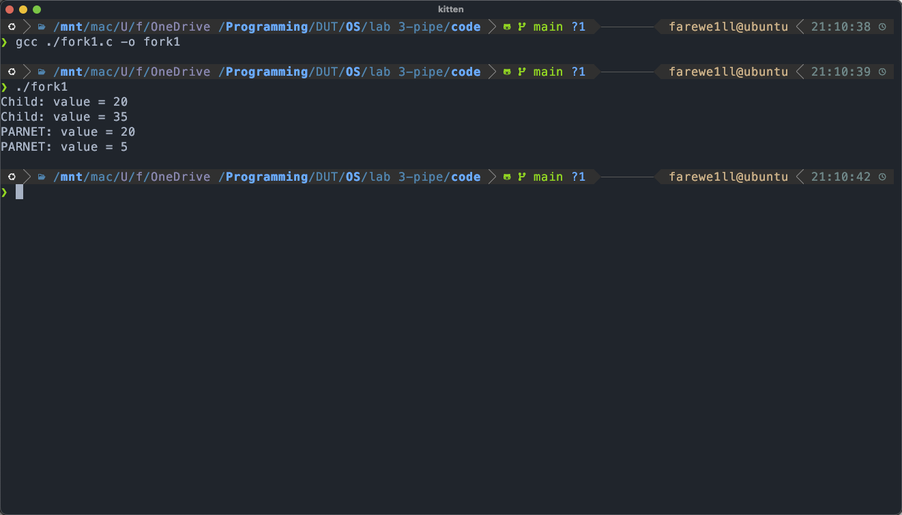

# lab 3: pipe

## `ppipe.c`

编码 `ppipe.c` 代码

在 `Orbstack Machines` 中完成 `Make` 结果

该代码演示了如何使用匿名管道在父子进程间做双向通信，并通过不断读写、递增一个整型值来轮流打印消息。

- `pipe1` 用于父进程写 → 子进程读
- `pipe2` 用于子进程写 → 父进程读

`fork()` 出一个子进程
- 如果 `返回值 < 0`：报错并退出
- 如果 `返回值 == 0`：子进程分支
- 否则：父进程分支

子进程
1. 关闭 `pipe1[1]`（写端）和 `pipe2[0]`（读端）
2. `do...while`:
	1. 从 `pipe1[0]` 读取整数 `x`
	2. 打印，然后 `x++`
	3. 将递增后的 `x` 写到 `pipe2[1]`
	4. 重复直到 `x > 9`
3. 关闭剩余的管道端口

父进程
1. 关闭 `pipe1[0]`（读端）和 `pipe2[1]`（写端）
2. 初始化 `x = 1`
3. `do...while`:
	1. 把 `x` 写入 `pipe1[1]`
	2. 从 `pipe2[0]` 读回新的 `x`
	3. 打印，然后 `x++`
	4. 重复直到 `x > 9`
4. 关闭管道端口

## assignment

编写 `demo.c` 代码

`demo.c` 在 `Orbstack Machines` 中的编译运行结果

定义两个递归函数:
- `calcx(int x)` 计算 `x` 的阶乘，`x == 1` 时返回 `1`，否则递归 `calcx(x - 1) * x`。
- `calcy(int y)` 计算 `y` 的斐波那契数，`y == 1 || y == 2` 时返回 `1`，否则递归 `calcy(y - 1) + calcy(y - 2)`。

主函数：
从标准输入读入两个整数 `x` 和 `y`。
用一个 `for (int i = 0; i < 2; ++i)` 循环，先后处理 `x` 和 `y`。
每次循环都新建两条管道：
- `pipesf` 用于父进程向子进程发送原始参数
- `pipefs` 用于子进程把计算结果发回父进程
调用 `fork()` 派生子进程：
子进程关闭不需要的一端，通过 `read(pipesf[0],...)` 接收父进程传来的 `x` 或 `y`，调用对应的递归函数，并 `write(pipefs[1],...)` 把结果发回。处理完毕后关闭管道并 `exit(0)`。
父进程对应地关闭另一端，通过 `write(pipesf[1],...)` 发送参数给子进程，`read(pipefs[0],...)` 读取子进程返回的结果到 `ansx` 或 `ansy`，并打印中间结果 `f(x) = ...` 或 `f(y) = ...`。然后 `waitpid` 等待子进程结束。
循环结束后，父进程将两次计算结果相加，打印 `f(x, y) = ansx + ansy`，并正常返回。

## `fork1.c`

`fork1.c` 在 `Orbstack Machines` 中的编译运行结果

`int value = 5; // where?`
- `value` 是一个全局变量，存放在进程的全局数据区中。
- `fork` 后父子进程各自拥有一份独立的数据区副本，互不干扰。

`int i; // where?`
- `i` 是 `main` 函数的局部变量，存放在栈中。
- `fork` 会复制父进程的栈，父子进程各持有自己的一份 `i`。

`for (int i = 0; i < 2; ++i) { // How many new processes and printfs?`
由于 `exit(0)` 放在父进程的 `else` 分支里，父进程在第一次 `fork` 后就退出，不会再参与第二次循环。
过程如下：
1. 原始进程 `P` 第一次 `fork` 产生子进程 `C1`。
- `C1` 执行子进程分支，`value = 5 + 15 = 20`，打印 `Child: value = 20`。
- `P` 等待 `C1` 结束，打印 `PARENT: value = 5`，然后 `exit(0)` 结束。
2. `C1` 因为是子进程，没有执行 `exit`，又进入第二次 `i = 1` 循环，`fork` 产生 `C2`。
- `C2` 执行子进程分支，`value = 20 + 15 = 35`，打印 `Child: value = 35`。
- `C1` 等待 `C2` 结束，打印 `PARENT: value = 20`，然后 `exit(0)` 结束。
整个程序只创建了 $2$ 个子进程，总共会输出 $4$ 次 `printf`。

`exit(0); // What will happen with or without this line?`
若有 `exit(0)`，父进程（或 `C1` 在它当时做为父进程的那次 `fork`）在打印后立即退出，不会继续 `for` 循环，也不会再 `fork`。
若去掉 `exit(0)`，所有还存活的进程都会继续执行后续的循环迭代，导致更多的 `fork` 调用，总进程数会指数增长。