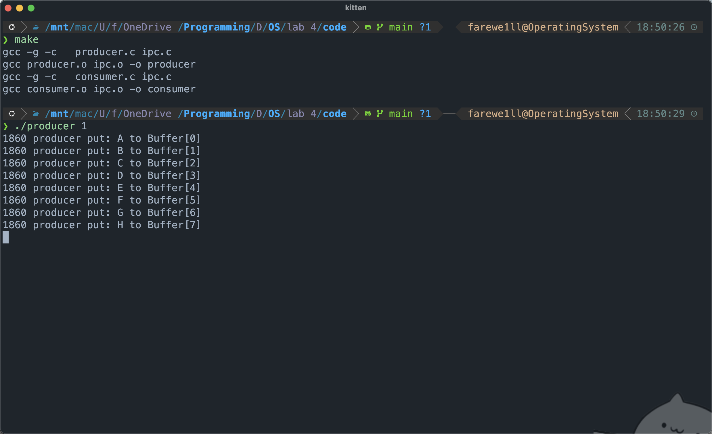
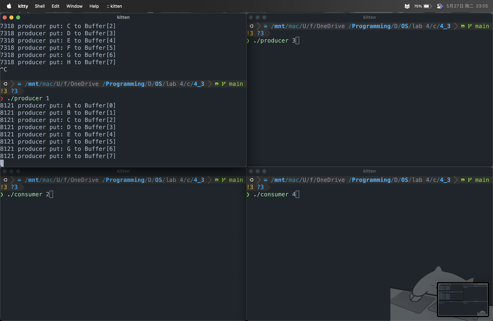
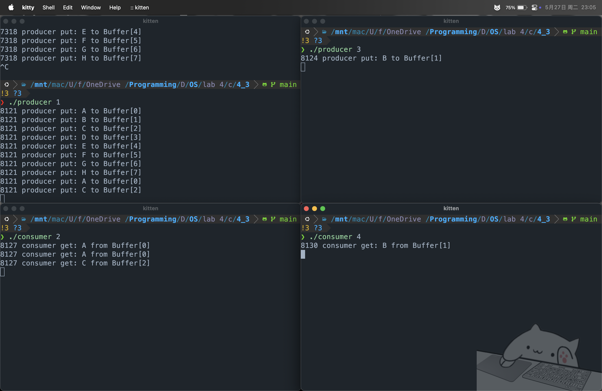
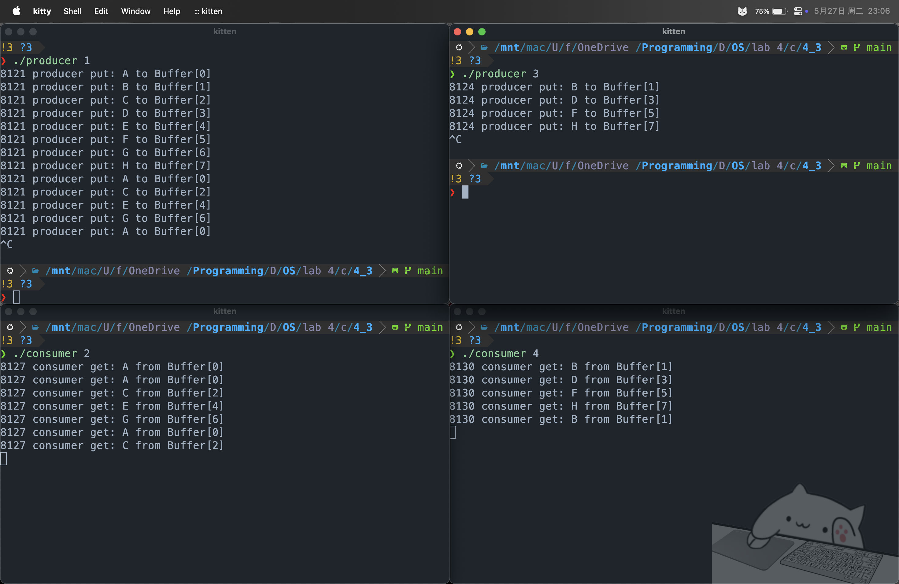
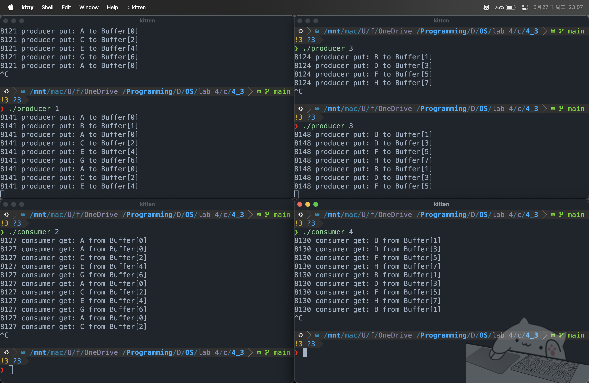
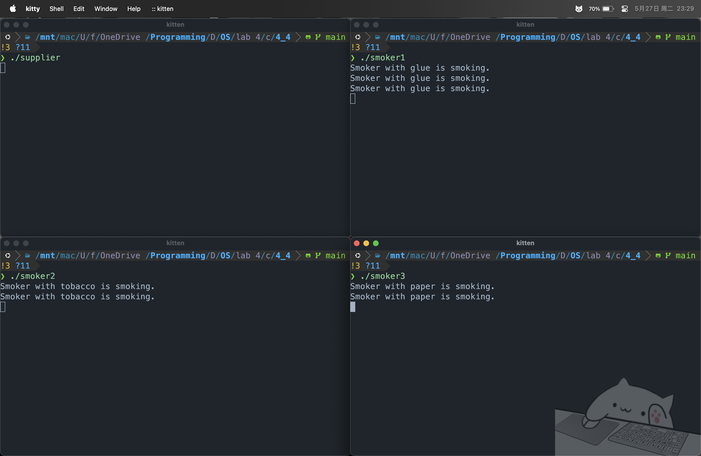

# lab 4: IPC

## 4.3 示例实验

提取并编写 `ipc.h、ipc.c、producer.c、consumer.c` 代码


在 `Orbstack Machines` 中完成 `Make` 并且开始调用 `./producer 1`，发现只启动生产者时，会出现向共享内存写入超过8个字符的问题

检查发现问题如下：
缺少消费者互斥信号量，在 `producer.c` 中，只创建了生产者互斥信号量 `pmtx_sem`，但没有创建消费者互斥信号量 `cmtx_sem`。
当创建新的共享内存时，`pput_ptr` 和 `cget_ptr` 指向的内存没有初始化，可能包含随机值。
`set_shm` 函数在创建新共享内存时会初始化为 $0$，但是如果共享内存已经存在，则不会重新初始化。故而如果这不是第一次运行程序，`pput_ptr` 指向的值可能不是 $0$，而是上次程序运行时的值，这会导致生产者从一个非 $0$ 的位置开始写入。

对代码进行修改后运行结果如下


此后按要求执行代码，可以看到四个进程相互交互、生产者停止生产、消费者停止消费的效果。





## 4.4 独立实验

编写 `supplier.c、smoker*.c` 代码

```cpp
// supplier.c

#include "ipc.h"
#include <unistd.h>

int sem_tobacco_paper, sem_paper_glue, sem_tobacco_glue, sem_done;

int main() {
	key_t key1 = 1234, key2 = 1235, key3 = 1236, key_done = 1237;
	int sem_flg = IPC_CREAT | 0666;

	sem_tobacco_paper = set_sem(key1, 0, sem_flg);
	sem_paper_glue = set_sem(key2, 0, sem_flg);
	sem_tobacco_glue = set_sem(key3, 0, sem_flg);
	sem_done = set_sem(key_done, 0, sem_flg);

	while (1) {
		static int i = 0;
		switch (i % 3) {
			case 0: up(sem_tobacco_paper); break;
			case 1: up(sem_paper_glue); break;
			case 2: up(sem_tobacco_glue); break;
		}
		i++;
		down(sem_done);
		sleep(1);
	}
	return 0;
}
```

```cpp
/// smoker1.c, smoker2、3以此类推
#include "ipc.h"

int sem_tobacco_paper, sem_done;

int main() {
	key_t key1 = 1234, key_done = 1237;

	sem_tobacco_paper = get_ipc_id("/proc/sysvipc/sem", key1);
	sem_done = get_ipc_id("/proc/sysvipc/sem", key_done);

	for (; ;) {
		down(sem_tobacco_paper);
		printf("Smoker with glue is smoking.\n");
		up(sem_done);
	}
	return 0;
}
```

程序分析：

1. `supplier.c` - 供应者程序

> 工作流程：
> 循环供应材料组合，按顺序轮流提供三种组合
> 使用 `up()` 操作释放对应的信号量，通知相应的吸烟者
> 使用 `down(sem_done)` 等待吸烟者完成抽烟
> 等待 $1$ 秒后继续下一轮

2. smoker.c - 吸烟者

> 工作流程：
> 使用 `down(sem_xxx_xxx)` 等待供应者提供烟草和纸
> 当获得材料后，开始抽烟并打印消息
> 使用 `up(sem_done)` 通知供应者已完成抽烟

同步机制分析
> `sem_tobacco_paper`: 控制烟草+纸组合的供应
> `sem_paper_glue`: 控制纸+胶水组合的供应
> `sem_tobacco_glue`: 控制烟草+胶水组合的供应
> `sem_done`: 确保供应者等待吸烟者完成后再继续

运行结果


## 4.5 Summary

### 1. 操作系统中并发进程同步机制的实现原理
在真实操作系统中，进程同步机制通过**信号量（Semaphore）**和**互斥锁（Mutex）**等工具实现。实验中，Linux通过**IPC（进程间通信）工具**（如共享内存、信号量）实现了上述机制：
- **信号量**：通过 `semget`、`semop`、`semctl` 等系统调用管理。
- **共享内存**：通过 `shmget`、`shmat`、`shmdt` 等实现数据共享。
- **消息队列**：通过 `msgget`、`msgsnd`、`msgrcv` 等传递消息。

### 2. 信号量机制如何解决同步问题
信号量机制通过**资源计数**和**进程阻塞/唤醒**解决同步问题：
- 同步
  例如生产者-消费者问题中，通过两个信号量控制缓冲区状态：
  - 满槽表示已生产的数量（消费者可消费的数量）。
  - 空槽表示可用的缓冲区空间（生产者可生产的数量）。
  生产者通过 `down(empty)` 等待空槽，`up(full)` 通知消费者；消费者通过 `down(full)` 等待满槽，`up(empty)` 通知生产者。

- 互斥（Mutual Exclusion）
  通过二进制信号量（互斥锁）确保同一时间只有一个进程访问共享资源。例如：
  - 生产者互斥信号量: 防止多个生产者同时写入缓冲区。
  - 消费者互斥信号量: 防止多个消费者同时读取缓冲区。

### 3. 信号量的初值及值变化的物理意义
- 信号量的初值
  - 生产者同步信号量: 初值为缓冲区大小（例如 `BUFSZ = 8`），表示初始时缓冲区有 $8$ 个空槽。
  - 消费者同步信号量: 初值为 $0$，表示初始时缓冲区无产品可消费。
  - 互斥信号量: 初值为 $1$，表示初始时允许一个进程进入临界区。

- 信号量值的变化
  - 生产者操作
    - `down(prod_sem)`：信号量值减 $1$（空槽减少）。
    - `up(cons_sem)`：信号量值加 $1$（满槽增加）。
  - 消费者操作
    - `down(cons_sem)`：信号量值减 $1$（满槽减少）。
    - `up(prod_sem)`：信号量值加 $1$（空槽增加）。
  - 互斥操作
    - `down(pmtx/cmtx)`：信号量值从 $1$ 变为 $0$，表示占用资源。
    - `up(pmtx/cmtx)`：信号量值从 $0$ 变为 $1$，表示释放资源。

### 4. 多于4个生产者/消费者的测试分析
实验中的生产者和消费者程序支持任意数量的并发进程，因为
- 信号量机制是全局的: 所有生产者共享同一个 `prod_sem` 和 `pmtx`，所有消费者共享同一个 `cons_sem` 和 `cmtx`。
- 互斥和同步逻辑独立: 每个生产者/消费者仅需关注信号量的 P/V 操作，无需关心其他进程的数量或顺序。