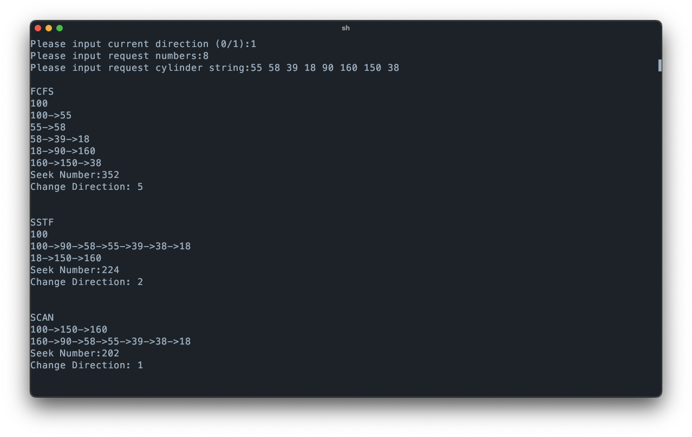

# Lab 6: disk scheduling

## 6.3 示例实验

提取并编写 `./code/dask.h` 代码
```cpp
#include <iostream>
#include <iomanip>
#include <cstdlib>

class DiskArm {
	public:
		DiskArm();
		~DiskArm();
		void InitSpace(char* MethodName); //初始化寻道记录
		void Report(); //报告算法执⾏情况
		void FCFS();
		void SSTF();
		void SCAN();
		void CSCAN();
		void LOOK();
	private:
		int *Request; //磁盘请求道号
		int *Cylinder; //⼯作柱⾯道号
		int RequestNumber; //磁盘请求数
		int CurrentCylinder; //当前道号
		int SeekDirection; //磁头⽅向
		int SeekNumber; //移臂总数
		int SeekChange; //磁头调头数
};
```

提取并编写不完全的 `./code/dask.cpp` 代码
```cpp
#include "dask.h"
#include <climits>
#include <cstdlib>

DiskArm::DiskArm() {
	std::cout << "Please input current Cylinder:";
	std::cin >> CurrentCylinder;
	//磁头⽅向
	// 0 ：向⼩磁道号⽅向移动
	// 1 ：向⼤磁道号⽅向移动
	std::cout << "Please input current direction (0/1):";
	std::cin >> SeekDirection;
	//输入磁盘请求数，请求道号
	std::cout << "Please input request numbers:";
	std::cin >> RequestNumber;
	std::cout << "Please input request cylinder string:";
	Request = new int[RequestNumber];
	Cylinder = new int[RequestNumber];
	for (int i = 0; i < RequestNumber; ++i)
		std::cin >> Request[i];
}

DiskArm::~DiskArm() {
	delete[] Request;
	delete[] Cylinder;
}
//初始化道号，寻道记录

void DiskArm::InitSpace(char *MethodName) {
	std::cout << std::endl << MethodName << std::endl;
	SeekNumber = 0;
	SeekChange = 0;
	for (int i = 0; i < RequestNumber; ++i)
		Cylinder[i] = Request[i];
}
//统计报告算法执⾏情况
void DiskArm::Report() {
	std::cout << std::endl;
	std::cout << "Seek Number:" << SeekNumber << std::endl;
	std::cout << "Change Direction: " << SeekChange << std::endl << std::endl;
}
void DiskArm::FCFS() {
	int Current = CurrentCylinder;
	int Direction = SeekDirection;
	InitSpace(const_cast<char*>("FCFS"));
	std::cout << Current;
	for (int i = 0; i < RequestNumber; ++i) {
		bool needChangeDirection = ((Cylinder[i] < Current) && Direction) ||
		((Cylinder[i] > Current) && !Direction);
		if (needChangeDirection) {
			Direction = !Direction;
			++SeekChange; //调头数加1
			//报告当前响应的道号
			std::cout << std::endl << Current << "->" << Cylinder[i];
		} else {
			//不需要调头，报告当前响应的道号
			std::cout << "->" << Cylinder[i];
		}
			//累计寻道数，响应过的道号变为当前道号
		SeekNumber += abs(Current - Cylinder[i]);
		Current = Cylinder[i];
	}
	Report();
}
//报告磁盘调度情况
void DiskArm::SSTF() {
	// TODO;
}
void DiskArm::SCAN() {
	// TODO;
}
void DiskArm::CSCAN() {
	// TODO;
}
void DiskArm::LOOK() {
	// TODO;
}
```

发现如下问题：
- `dask.cpp` 的 `Request`、`Cylinder` 数组申请空间有误，应为 `RequestNumber` 而非 `sizeof(int) * RequestNumber`。
- 代码中使用了 `INT_MAX` 而未引入 `<climits>`。
- 代码所使用的 `<malloc.h>` 在 C++ 中应该改为 `<cstdlib>`。
- `InitSpace("FCFS");` 的传参方式在 C++11 后不被支持，应改为 `InitSpace(const_cast<char*>("FCFS"));`。

并且为 `dask.cpp` 添加了 `main` 函数。

## 6.4 完成实验

除却给出的 `FCFS` 算法外，实现其他 $4$ 种磁盘调度算法：
1. **SSTF (Shortest Seek Time First)** - 最短寻找时间优先算法
2. **SCAN** - 扫描算法（电梯算法）
3. **CSCAN (Circular SCAN)** - 循环扫描算法
4. **LOOK** - 观察算法

### `SSTF` 实现
```cpp
void DiskArm::SSTF(){
	int Current = CurrentCylinder;
	int Direction = SeekDirection;
	InitSpace(const_cast<char*>("SSTF"));
	std::cout << Current;

	bool* processed = new bool[RequestNumber];
	for (int i = 0; i < RequestNumber; ++i) {
		processed[i] = false;
	}

	for (int count = 0; count < RequestNumber; ++count) {
		int minDistance = INT_MAX;
		int nextIndex = -1;

		for (int i = 0; i < RequestNumber; ++i) {
			if (!processed[i]) {
				int distance = abs(Current - Cylinder[i]);
				if (distance < minDistance) {
					minDistance = distance;
					nextIndex = i;
				}
			}
		}

		bool needChangeDirection = ((Cylinder[nextIndex] > Current)&&!Direction) || ((Cylinder[nextIndex] < Current) && Direction);
		if (needChangeDirection) {
			Direction = !Direction;
			++SeekChange;
			std::cout << std::endl << Current << "->" << Cylinder[nextIndex];
		} else {
			std::cout << "->" << Cylinder[nextIndex];
		}

		SeekNumber += minDistance;
		Current = Cylinder[nextIndex];
		processed[nextIndex] = true;
	}

	delete[] processed;
	Report();
}
```

`SSTF` 算法的核心是贪心策略，每次选择最近的请求。

### `SCAN` 实现
```cpp
void DiskArm::SCAN() {
	int Current = CurrentCylinder;
	int Direction = SeekDirection;
	InitSpace(const_cast<char*>("SCAN"));
	std::cout << Current;

	int* sortedCylinders = new int[RequestNumber];
	for (int i = 0; i < RequestNumber; ++i) {
		sortedCylinders[i] = Cylinder[i];
	}

	std::sort(sortedCylinders, sortedCylinders + RequestNumber);

	int pos = std::lower_bound(sortedCylinders, sortedCylinders + RequestNumber, CurrentCylinder) - sortedCylinders;

	int count = 0;
	if (Direction) {
		for (int i = pos; i < RequestNumber; ++i) {
			std::cout << "->" << sortedCylinders[i];
			SeekNumber += abs(Current - sortedCylinders[i]);
			Current = sortedCylinders[i];
			++count;
		}

		if (count < RequestNumber) {
			++SeekChange;
			std::cout << std::endl << Current;

			for (int i = pos - 1; i >= 0; --i) {
				std::cout << "->" << sortedCylinders[i];
				SeekNumber += abs(Current - sortedCylinders[i]);
				Current = sortedCylinders[i];
			}
		}
	} else {
		int processedCount = 0;
		for (int i = pos - 1; i >= 0; --i) {
			std::cout << "->" << sortedCylinders[i];
			SeekNumber += abs(Current - sortedCylinders[i]);
			Current = sortedCylinders[i];
			++processedCount;
		}

		if (processedCount < RequestNumber) {
			++SeekChange;
			std::cout << std::endl << Current;

			for (int i = pos; i < RequestNumber; ++i) {
				std::cout << "->" << sortedCylinders[i];
				SeekNumber += abs(Current - sortedCylinders[i]);
				Current = sortedCylinders[i];
			}
		}
	}

	delete[] sortedCylinders;
	Report();
}
```

`SCAN` 算法通过排序和二分查找来确定处理顺序。

### `CSCAN` 实现
```cpp
void DiskArm::CSCAN() {
	int Current = CurrentCylinder;
	int Direction = SeekDirection;
	InitSpace(const_cast<char*>("CSCAN"));
	std::cout << Current;

	int* sortedCylinders = new int[RequestNumber];
	for (int i = 0; i < RequestNumber; ++i) {
		sortedCylinders[i] = Cylinder[i];
	}

	std::sort(sortedCylinders, sortedCylinders + RequestNumber);

	int pos = std::lower_bound(sortedCylinders, sortedCylinders + RequestNumber, CurrentCylinder) - sortedCylinders;

	if (Direction) {
		for (int i = pos; i < RequestNumber; ++i) {
			std::cout << "->" << sortedCylinders[i];
			SeekNumber += abs(Current - sortedCylinders[i]);
			Current = sortedCylinders[i];
		}

		if (pos > 0) {
			++SeekChange;
			std::cout << std::endl << Current;
			SeekNumber += abs(Current - sortedCylinders[0]);
			Current = sortedCylinders[0];
			std::cout << "->" << Current;

			for (int i = 1; i < pos; ++i) {
				std::cout << "->" << sortedCylinders[i];
				SeekNumber += abs(Current - sortedCylinders[i]);
				Current = sortedCylinders[i];
			}
		}
	} else {
		for (int i = pos - 1; i >= 0; --i) {
			std::cout << "->" << sortedCylinders[i];
			SeekNumber += abs(Current - sortedCylinders[i]);
			Current = sortedCylinders[i];
		}

		if (pos < RequestNumber) {
			++SeekChange;
			std::cout << std::endl << Current;
			SeekNumber += abs(Current - sortedCylinders[RequestNumber - 1]);
			Current = sortedCylinders[RequestNumber - 1];
			std::cout << "->" << Current;

			for (int i = RequestNumber - 2; i >= pos; --i) {
				std::cout << "->" << sortedCylinders[i];
				SeekNumber += abs(Current - sortedCylinders[i]);
				Current = sortedCylinders[i];
			}
		}
	}

	delete[] sortedCylinders;
	Report();
}
```

`CSCAN` 在 `SCAN` 的基础上将每次将磁头迅速移动至起始端开始扫描，请求处理更加有序，但是可能会增加等待时间。

### `LOOK` 实现
```cpp
void DiskArm::LOOK() {
	int Current = CurrentCylinder;
	int Direction = SeekDirection;
	InitSpace(const_cast<char*>("LOOK"));
	std::cout << Current;

	int* larger = new int[RequestNumber];
	int* smaller = new int[RequestNumber];
	int largerCount = 0, smallerCount = 0;

	for (int i = 0; i < RequestNumber; ++i) {
		if (Cylinder[i] >= Current) {
			larger[largerCount++] = Cylinder[i];
		} else {
			smaller[smallerCount++] = Cylinder[i];
		}
	}

	std::sort(smaller, smaller + smallerCount, std::greater<int>());
	std::sort(larger, larger + largerCount);

	if (Direction) {
		for (int i = 0; i < largerCount; ++i) {
			std::cout << "->" << larger[i];
			SeekNumber += abs(Current - larger[i]);
			Current = larger[i];
		}

		if (smallerCount > 0) {
			++SeekChange;
			std::cout << std::endl << Current;

			for (int i = 0; i < smallerCount; ++i) {
				std::cout << "->" << smaller[i];
				SeekNumber += abs(Current - smaller[i]);
				Current = smaller[i];
			}
		}
	} else {
		for (int i = 0; i < smallerCount; ++i) {
			std::cout << "->" << smaller[i];
			SeekNumber += abs(Current - smaller[i]);
			Current = smaller[i];
		}

		if (largerCount > 0) {
			++SeekChange;
			std::cout << std::endl << Current;

			for (int i = 0; i < largerCount; ++i) {
				std::cout << "->" << larger[i];
				SeekNumber += abs(Current - larger[i]);
				Current = larger[i];
			}
		}
	}

	delete[] larger;
	delete[] smaller;
	Report();
}
```

`LOOK` 在 `SCAN` 的基础上不将磁头移动至磁盘两端，而是移动至当前方向上最远请求再折返，避免了不必要的移动。

### 性能统计

每个算法都会调用`InitSpace()`初始化和`Report()`报告结果：

```cpp
void DiskArm::Report() {
    std::cout << std::endl;
    std::cout << "Seek Number:" << SeekNumber << std::endl;
    std::cout << "Change Direction: " << SeekChange << std::endl << std::endl;
}
```

统计指标包括：
- `SeekNumber`: 总寻道距离
- `SeekChange`: 磁头调头次数

## 编译与运行

### 编译代码
```bash
cd code
g++ -o dask dask.cpp
```

### 运行程序
```bash
./dask
```

### 输入示例
```text
Please input current Cylinder: 100
Please input current direction (0/1): 1
Please input request numbers: 8
Please input request cylinder string: 55 58 39 18 90 160 150 38
```

## 实验结果分析

程序将依次执行所有五种调度算法，并输出：
- 磁头移动轨迹
- 总寻道距离 (Seek Number)
- 磁头调头次数 (Change Direction)

### 实际运行示例

以下是使用测试数据的运行结果：
- 当前磁道位置：100
- 磁头移动方向：1 (向大道号方向)
- 请求数量：8
- 请求序列：55 58 39 18 90 160 150 38



```
FCFS
100->55->58->39->18->90->160->150->38
Seek Number:352
Change Direction: 5

SSTF
100->90->58->55->39->38->18->150->160
Seek Number:224
Change Direction: 2

SCAN
100->150->160->90->58->55->39->38->18
Seek Number:202
Change Direction: 1

CSCAN
100->150->160->18->38->39->55->58->90
Seek Number:274
Change Direction: 1

LOOK
100->150->160->90->58->55->39->38->18
Seek Number:202
Change Direction: 1
```

### 结果分析

从上述运行结果可以看出：

1. **FCFS算法**:
   - 寻道距离：352
   - 调头次数：5
   - 分析：按到达顺序服务，导致磁头频繁来回移动，效率最低

2. **SSTF算法**:
   - 寻道距离：224
   - 调头次数：2
   - 分析：总是选择距离最近的请求，大大减少了寻道距离

3. **SCAN算法**:
   - 寻道距离：202
   - 调头次数：1
   - 分析：电梯式移动，在本例中表现最佳

4. **CSCAN算法**:
   - 寻道距离：274
   - 调头次数：1
   - 分析：单向服务，在此例中不如SCAN，但在其他情况下可能提供更均匀的服务

5. **LOOK算法**:
   - 寻道距离：202
   - 调头次数：1
   - 分析：与SCAN结果相同，避免了到达磁盘边界的不必要移动

### 性能对比图表

| 算法 | 寻道距离 | 调头次数 | 平均寻道距离 | 性能排名 |
|:----:|:------:|:------:|:----------:|:-------:|
| FCFS | 352 | 5 | 44.0 | 5 |
| SSTF | 224 | 2 | 28.0 | 2 |
| SCAN | 202 | 1 | 25.25 | 1 |
| CSCAN | 274 | 1 | 34.25 | 4 |
| LOOK | 202 | 1 | 25.25 | 1 |

从表格可以看出：
- **SCAN和LOOK算法**在此测试用例中表现最佳
- **SSTF算法**次之，显著优于FCFS
- **CSCAN算法**虽然调头次数少，但总寻道距离较长
- **FCFS算法**表现最差，频繁调头导致效率低下

### 算法适用场景

1. **FCFS**: 适用于请求量较小、实时性要求不高的场景
2. **SSTF**: 适用于追求最短响应时间、但能容忍部分请求饥饿的场景
3. **SCAN**: 适用于大多数通用场景，平衡了效率和公平性
4. **CSCAN**: 适用于需要提供均匀服务时间的场景
5. **LOOK**: 适用于已知请求分布、追求最优性能的场景